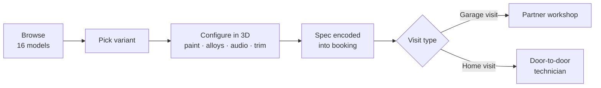

<div align="center">

# XYZI. Automative

### Configure your car in 3D. Book the garage. Get it built.

[](https://nextjs.org)
[](https://react.dev)
[](https://typescriptlang.org)
[](https://threejs.org)
[](https://tailwindcss.com)

`16 models` · `13 brands` · `4 customization categories` · `Live WebGL preview` · `Door-to-door service`

</div>

---

<div align="center">

<!-- Drop screenshots into docs/ and they will render here -->


</div>

---

## The problem

> Car modification is opaque. You describe what you want to a workshop, they describe it back, and neither side knows what the result looks like until the money is spent.

**XYZI. Automative closes that gap.**



The spec travels with the booking, so the workshop receives an unambiguous build sheet instead of a conversation. The end model is a tie-up network with car company workshops and independent tuning shops offering door-to-door modification.

---

## What it does

| | Feature | Where |
|:--:|---|---|
| 🎨 | **Live 3D configurator.** Paint, alloys, subwoofers and cabin trim, re-rendered instantly | `/models` |
| 📐 | **CAD wireframe mode.** Glowing green engineering schematic view | `/models` |
| 🪑 | **360° interior view.** Camera drops inside the cabin, drag to look around | `/models` |
| 🔊 | **Animated trunk reveal.** Boot opens to show the fitted subwoofer, cones pulse to bass | `/models` |
| 🚗 | **16 models, 13 brands.** Search, category filters, favourites, grid/list toggle | `/models` `/brands` |
| 📅 | **3-step booking wizard.** Validated, with garage visit or home visit | `/test-drive` |
| 🔗 | **Spec carry-over.** Your 3D build auto-fills the booking form via URL params | both |
| 🌗 | **Light and dark theme.** Persisted, driven by CSS custom properties | site-wide |
| 🔐 | **Optional accounts.** Password or OTP login, strength meter on signup | `/login` `/signup` |

---

## Quick start

```bash
git clone https://github.com/tanishhhk/Car-Modifier.git
cd Car-Modifier
npm install
npm run dev
```

→ <http://localhost:3000>

<sub>Requires Node 18.18+ (20+ recommended). `npm run build` for production, `npm run start` to serve it.</sub>

---

## The configurator in detail

<table>
<tr><th align="left">Category</th><th align="left">Options</th></tr>
<tr><td><b>Paint</b></td><td>5 curated swatches per car, plus a free-form colour picker (any hex)</td></tr>
<tr><td><b>Alloy wheels</b></td><td>Chrome Spoke · Matte Black Star · Golden Mesh · Sport Red Line</td></tr>
<tr><td><b>Subwoofers</b></td><td>Factory (none) · Bass King 12" · JBL Club 1000W · Sony Xplod Duo</td></tr>
<tr><td><b>Cabin trim</b></td><td>Premium Tan Leather · Carbon Sport Red · Royal Cream Alcantara · Midnight Obsidian</td></tr>
</table>

<details>
<summary><b>How the 3D engine works</b></summary>

<br>

A custom Three.js scene with no react-three-fiber and no OrbitControls. Camera orbit, zoom clamping, drag inertia and touch handling are implemented directly against the WebGL renderer.

**Viewer modes**

| Mode | Behaviour |
|---|---|
| Exterior | 360° orbit, auto-rotate with wheels spinning, drag to inspect, scroll or pinch to zoom |
| Interior | Camera inside the cabin, drag to pan across dashboard, steering wheel, seats |
| CAD wireframe | Whole model switches to a glowing green wireframe schematic |
| Trunk open | Boot lid animates open to reveal the subwoofer enclosure |

**Live animation.** Auto-rotate with play/pause, wheels rotating in sync, subwoofer cones pulsing on a sine wave, zoom and reset controls overlaid on the canvas, progress bar while the model initialises.

**Model loading.** `Car3DViewer` first tries `/public/models/{carId}.glb` via `GLTFLoader`, mapping selections onto GLTF materials by name. If no GLB exists it silently falls back to a procedurally generated model built from Three.js primitives, with per-category proportions. The sports body gets a rear wing, the SUV gets a taller grille and third-row geometry.

**This is the extension point.** Drop a `.glb` into `/public/models/` named after the car ID and it is used automatically, with no code change.

</details>

<details>
<summary><b>Booking flow and partner garages</b></summary>

<br>

**Step 1.** Name, email (regex validated), phone with country-code selector (IN, US, UK, AU, JP, DE).

**Step 2.** Car model, variant, partner garage, date (no past dates), time slot (8 slots, 9 AM to 5 PM), city (10 Indian cities), and visit type.

**Step 3.** Full spec summary, then confirmation.

**Visit type is the business differentiator:**

- **Garage visit.** Customer goes to the partner shop.
- **Home visit.** Technician team comes to the customer, address becomes required. This is the door-to-door service.

**Seeded partner garages**

| Garage | Rating | Speciality |
|---|:--:|---|
| Apex Auto Customizers | 4.9 | Alloys, paint, suspension |
| Precision Tuning & Audio | 4.8 | Subwoofers, system tuning |
| GlowDrive Body & Paint Shop | 4.7 | Metallic and matte wraps |
| HyperAudio Woofers | 4.9 | Soundproofing, trunk audio |
| Elite Leather Interiors | 4.8 | Alcantara, leather, console trim |

**Spec carry-over.** Finishing a build pushes to `/test-drive?car=&variant=&paint=&alloy=&woofer=&interior=` and the form auto-fills. The customer never re-enters what they just designed.

</details>

<details>
<summary><b>Catalogue, brands and accounts</b></summary>

<br>

**Catalogue** (`/models`). 16 models across Sedan, SUV, Luxury and Sports. Live search on model and brand name, category filter pills, brand filtering via `?brand=` query param, grid and list toggle, favourites persisted in `localStorage`, result count and empty state.

**Brands** (`/brands`). 13 brands including Honda, Mahindra, Toyota, Maruti, Hyundai, Tata, Mercedes, Audi, Rolls Royce, Ferrari, Volkswagen and Skoda. Segment filters for Budget, Premium, Luxury and Sports. Each card shows country, founding year, tagline, model count and brand accent colour, and deep-links into the filtered catalogue.

**Variants.** Each car exposes real trim levels (Honda City gives V MT Petrol, VX CVT Petrol, ZX Hybrid eHEV). Selecting one is what loads the corresponding CAD schematic, and it is the hook point for variant-specific geometry once real CAD lands.

**Accounts** (`/login`, `/signup`). Email and password signup with a live strength meter, login by password or OTP, session in `localStorage`, navbar swapping between Login and Logout. Accounts are optional, and the configurator and booking work fully logged-out.

**Supporting pages.** Home with an animated typing hero and featured models, About with mission and process, FAQ with 11 questions across four categories in a filtered accordion.

</details>

---

## Project structure

```
app/
├── page.tsx              Home: typing hero, featured models, process
├── models/page.tsx       Catalogue + variant picker + 3D configurator   628 lines
├── brands/page.tsx       Brand explorer with segment filters
├── test-drive/page.tsx   3-step garage appointment wizard               428 lines
├── login/page.tsx        Password and OTP login
├── signup/page.tsx       Signup with password strength meter
├── about/page.tsx        Mission, tech, values, team, milestones
├── faq/page.tsx          Categorised FAQ accordion
├── layout.tsx            Root layout, navbar and footer
└── globals.css           Theme tokens, light/dark, utility classes

components/
├── Car3DViewer.tsx       Three.js scene, procedural + GLTF pipeline     810 lines
├── CarCard.tsx           Catalogue card, favourite and configure
├── CarModal.tsx          Quick-view spec modal
├── BrandCard.tsx         Brand tile
├── Navbar.tsx            Sticky nav, theme toggle, auth state
├── Footer.tsx            Site footer
└── FaqItem.tsx           Accordion item

lib/
├── cars.ts               16 models with full specs and variants
└── brands.ts             13 brands with segment metadata

public/
├── cars/                 Model photography
└── models/               ⚠️  GLB CAD assets go here (currently empty)
```

<details>
<summary><b>Data model and adding a car</b></summary>

<br>

```ts
interface CarModel {
  id: string;                                       // also the GLB filename
  name: string;
  brand: string;
  category: 'sedan' | 'suv' | 'luxury' | 'sports';  // drives procedural geometry
  img: string;
  engine: string;
  mileage: string;
  price: string;
  seats: number;
  colors: string[];                                 // hex swatches
  description: string;
  topSpeed?: string;
  horsepower?: string;
  variants: string[];                               // trim levels
}

interface Brand {
  id: string;
  name: string;
  country: string;
  segment: 'budget' | 'premium' | 'luxury' | 'sports';
  modelCount: number;
  founded: string;
  tagline: string;
  accentColor: string;
}
```

**To add a car:**

1. Drop the photo into `public/cars/`.
2. Append an entry to the `cars` array in `lib/cars.ts`.
3. Bump `modelCount` for the brand in `lib/brands.ts`, or add the brand if new.
4. Optionally add `public/models/{id}.glb` to replace the procedural mesh.

</details>

---

## Roadmap

The platform is **feature-complete end to end**. Browse, configure in 3D, book a garage appointment with the spec attached. Everything below stands between this build and a commercial launch.

### 🔴 1. Real 3D CAD models · blocking

Every car currently renders as a procedural approximation built from Three.js primitives. It communicates the concept, but it is not the customer's actual car.

**Needed:** one `.glb` per model, so **16 files**, dropped into `public/models/{carId}.glb`. The loader already exists and picks them up automatically.

<table>
<tr><th align="left">Requirement</th><th align="left">Spec</th></tr>
<tr><td>Format</td><td>glTF 2.0 binary (<code>.glb</code>), Draco-compressed, under ~5 MB</td></tr>
<tr><td>Material names</td><td><code>paint</code>/<code>body</code> → paint colour<br><code>alloy</code>/<code>wheel</code>/<code>rim</code> → alloy finish<br><code>interior</code>/<code>seat</code> → cabin trim</td></tr>
<tr><td>Interior</td><td>Dashboard, steering wheel, front and rear seats modelled</td></tr>
<tr><td>Trunk lid</td><td>Separate mesh, required for open animation and subwoofer reveal</td></tr>
<tr><td>Wheels</td><td>Separate meshes, required for rotation</td></tr>
<tr><td>Scale and origin</td><td>Centred at origin, roughly 4 to 4.5 units long, facing +X</td></tr>
</table>

**Sourcing.** Licensed marketplaces (Sketchfab, TurboSquid, CGTrader), a commissioned 3D artist, or most valuably, CAD obtained from the manufacturer or workshop partner as part of the tie-up.

Once these land, CAD mode becomes a genuine engineering wireframe of the real vehicle, which is the artefact a workshop can quote and build from.

### 🟠 2. Backend and persistence

Appointments end at a confirmation screen. Nothing is stored or transmitted, so a partner workshop would receive no leads. Needs a database, an appointment API, email and SMS confirmation, and a booking feed to the garage. Auth is `localStorage`-only and not secure, so replace it with real sessions before launch.

### 🟠 3. Pricing engine

Prices shown are the car's ex-showroom range, not the cost of the modifications. Needs per-part pricing for paint, each alloy set, each subwoofer and each trim, with a live running total and labour estimates per garage.

### 🟡 4. Partner garage network

Garages, cities and specialities are hardcoded arrays. Needs a real onboarding flow, garage profiles, geo-based matching, slot and capacity management, and a garage-side dashboard.

### 🟢 5. Nice-to-haves

Save and share configurations by link · order tracking · before and after gallery · payments and deposits.

---

## Known limitations

| Limitation | Impact |
|---|---|
| No 3D CAD assets shipped | All models are procedural fallbacks. Roadmap item 1. |
| No backend | Bookings, accounts and favourites live entirely in the browser. |
| Demonstration-grade auth | OTP is generated client-side, passwords are not verified against anything. |
| Indicative pricing | Not a modification quote. |
| WebGL required | Configurator will not render without it, and there is no fallback message. |

---

<div align="center">
<sub>

Not currently licensed for redistribution.<br>
Car names, brand names and logos are the property of their respective manufacturers and are used for identification only.

</sub>
</div>
